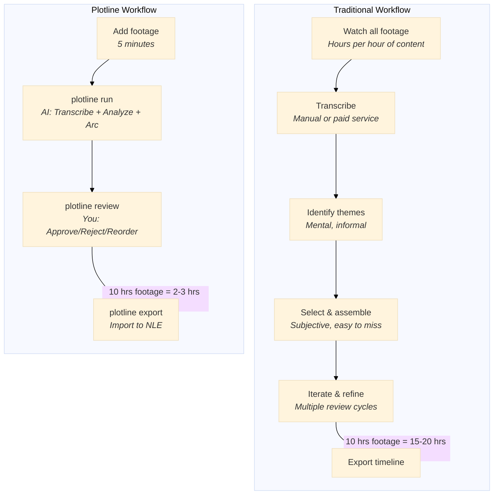
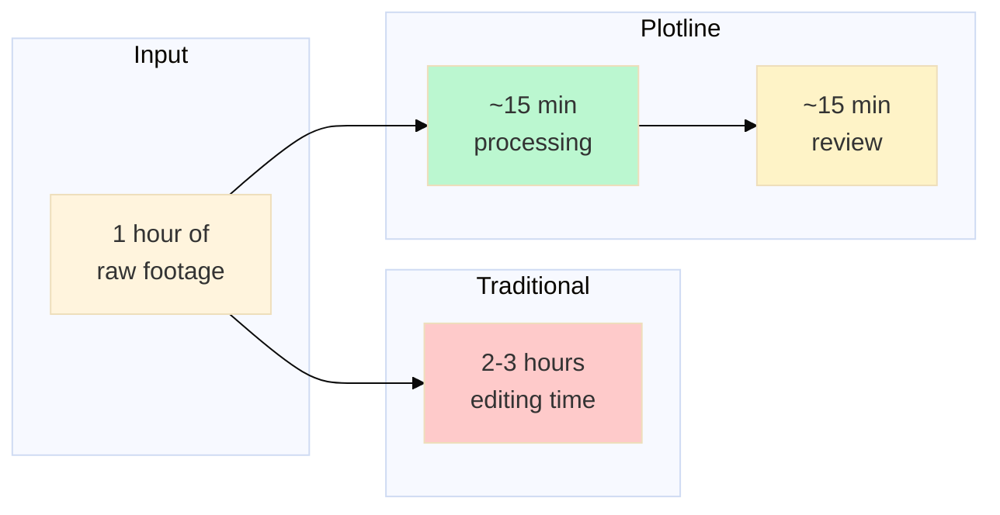
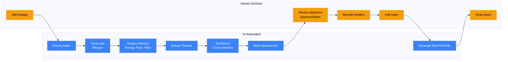
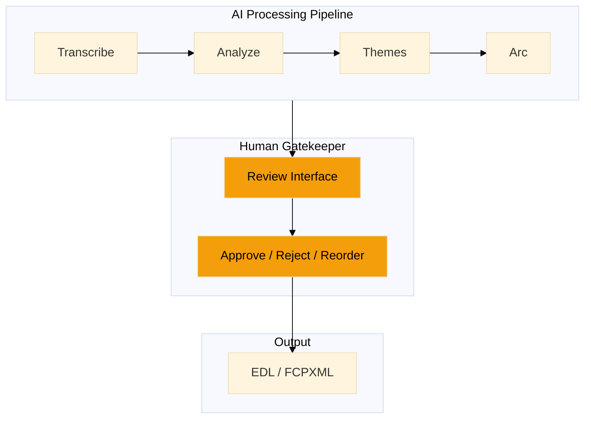
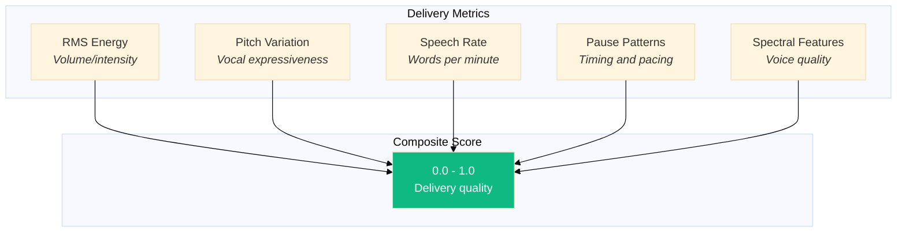
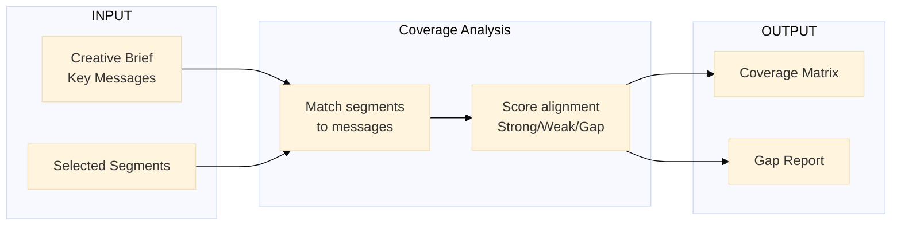
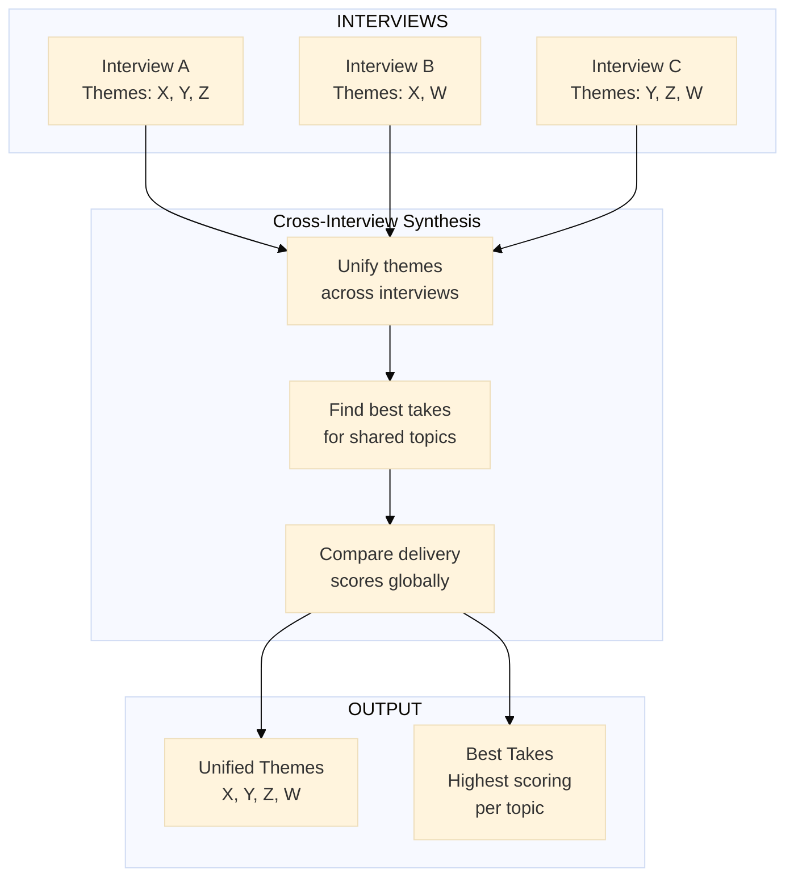
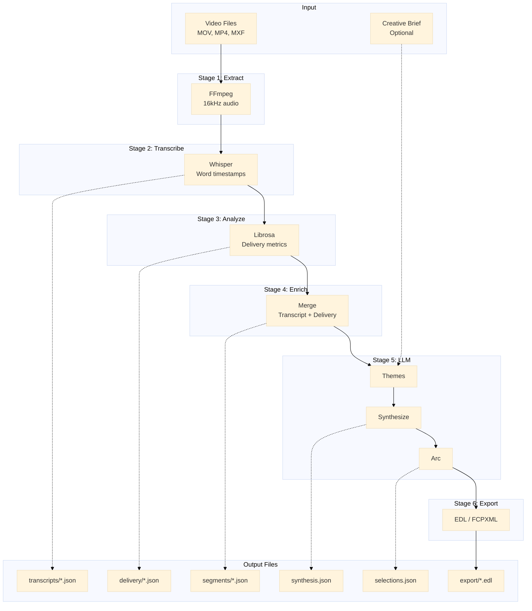

# Workflow Diagrams

Visual comparison of Plotline vs traditional documentary editing workflows.

---

## 1. Time Savings

### Side-by-Side Workflow Comparison



### Time Breakdown

| Task | Traditional | Plotline | Savings |
|------|-------------|----------|---------|
| **10 hours footage** | 15-20 hours | 2-3 hours | ~85% |
| Transcription | $100-300 or 5+ hours | Free, automatic | 100% |
| Theme identification | Mental, informal | AI cross-interview | — |
| Best take selection | Watch repeatedly | AI scores + ranks | — |
| Delivery assessment | Subjective | Measured metrics | — |

### Per-Hour Processing



---

## 2. AI vs Human Responsibilities

### Division of Labor



### The Human Always Has Final Say



**Key principle:** The AI proposes, the human decides. Every segment must pass through your review before reaching the final timeline.

---

## 3. Quality Improvements

### What Plotline Measures (That Traditional Editing Can't)



| Metric | What It Measures | Why It Matters |
|--------|------------------|----------------|
| **Energy** | RMS amplitude | Engaging speakers vary volume |
| **Pitch Variation** | Standard deviation of pitch | Monotone = boring |
| **Speech Rate** | Words per minute | Too fast/slow loses audience |
| **Pauses** | Silence before/after | Natural pacing, breathing room |
| **Spectral** | Voice brightness/texture | Audio quality, clarity |

### Brief Alignment



**Traditional approach:** Manually check if each message is covered. Easy to miss gaps.

**Plotline approach:** Automatic coverage matrix shows exactly which segments support which messages, and where you have gaps.

### Cross-Interview Synthesis



**Traditional approach:** Watch each interview separately, try to remember who said what best.

**Plotline approach:** AI identifies shared topics across all interviews, normalizes delivery scores globally, and ranks candidates so you can compare takes side-by-side.

---

## 4. Data Flow Architecture

### Pipeline Stages



### Data Transformations

| Stage | Input | Output | Tool |
|-------|-------|--------|------|
| **Extract** | Video files | 16kHz WAV + full-rate WAV | FFmpeg |
| **Transcribe** | Audio | Segments with word timestamps | Whisper |
| **Analyze** | Audio + segments | Delivery metrics per segment | Librosa |
| **Enrich** | Transcript + delivery | Unified segment data | Merge |
| **Themes** | Enriched segments | Per-interview themes | LLM |
| **Synthesize** | All themes | Unified cross-interview themes | LLM |
| **Arc** | Synthesis + brief | Narrative arc + selections | LLM |
| **Export** | Selections + approvals | EDL/FCPXML | Generator |

### File Structure

```
my-project/
├── plotline.yaml          # Configuration
├── interviews.json        # Manifest + stage status
├── brief.json             # Parsed creative brief
├── approvals.json         # Review approvals
├── source/                # Extracted audio
│   └── interview_001/
│       ├── audio_16k.wav  # For transcription
│       └── audio_full.wav # For delivery analysis
├── data/
│   ├── transcripts/       # Whisper output
│   ├── delivery/          # Librosa analysis
│   ├── segments/          # Enriched segments
│   ├── themes/            # Per-interview themes
│   ├── synthesis.json     # Cross-interview synthesis
│   └── selections.json    # Arc selections
├── reports/               # HTML reports
└── export/                # EDL/FCPXML files
```

---

## ASCII Reference (No Mermaid)

### Traditional Workflow

```
Watch all footage (hours/day)
        ↓
Transcribe (manual or $$$)
        ↓
Identify themes (mental)
        ↓
Select & assemble (subjective)
        ↓
Iterate & refine (many cycles)
        ↓
Export

TIME: ████████████████████ 100%
```

### Plotline Workflow

```
Add footage (5 min)
        ↓
plotline run
   ├── Extract audio
   ├── Transcribe (Whisper)
   ├── Analyze delivery
   ├── Extract themes
   ├── Synthesize cross-interview
   └── Build narrative arc
        ↓
plotline review
   ├── Listen to segment
   ├── Approve (A) or Reject (X)
   ├── Drag to reorder
   └── Add notes
        ↓
plotline export → Import to NLE

TIME: ███░░░░░░░░░░░░░░░ ~20%
```

### AI vs Human

```
┌─────────────────────────────────────────────────────┐
│  HUMAN          │  AI AUTOMATED                     │
├─────────────────┼───────────────────────────────────┤
│  Add footage    │  Extract audio                    │
│                 │  Transcribe (Whisper)             │
│                 │  Analyze delivery                 │
│                 │  Extract themes                   │
│                 │  Synthesize cross-interview       │
│                 │  Build narrative arc              │
│  Review         │                                   │
│  Approve/Reject │                                   │
│  Reorder        │                                   │
│  Add notes      │                                   │
│                 │  Generate EDL/FCPXML              │
│  Final export   │                                   │
└─────────────────┴───────────────────────────────────┘
```

### Data Flow

```
Video ──▶ Audio ──▶ Transcript ──▶ Delivery ──▶ Enriched
                                                      │
                                                      ▼
                                              Themes (per-interview)
                                                      │
                                                      ▼
                                              Synthesis (cross-interview)
                                                      │
                                                      ▼
                                              Narrative Arc
                                                      │
                                                      ▼
                                              Selections ──▶ EDL/FCPXML
```

---

## See Also

- **[Workflow Guide](workflow-guide.md)** — Step-by-step tutorial
- **[Export Guide](export-guide.md)** — NLE import workflows
- **[Reports Guide](reports-guide.md)** — HTML reports reference
